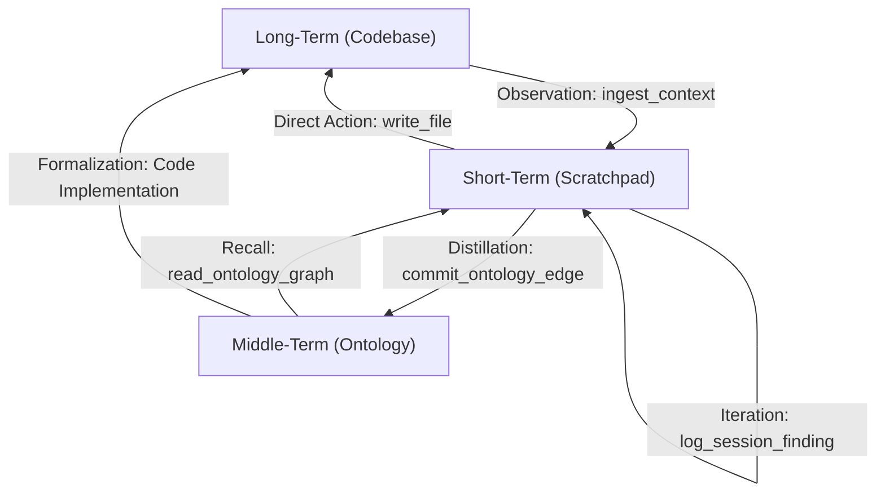

# Context Engine: Memory Architecture (Short, Middle, Long-Term)

The Context Engine implements a tiered memory system designed to optimize LLM performance while guaranteeing data provenance via the **UUID Registry Heuristic**.

## 1. Memory Tier Definitions

| Tier | Component | Persistence | Characteristics |
| :--- | :--- | :--- | :--- |
| **Short-Term** | [Scratchpad](file:///g:/Skill%20Archive/temp__mem/Head/server/internal/pokayoke/diagnostics.go#70-90) | Volatile (Session) | Current workflow findings, thinking steps, and active phase. Hard-capped at 10,000 characters to prevent context-bloat. |
| **Middle-term** | [Ontology](file:///g:/Skill%20Archive/temp__mem/Head/server/internal/ontology/ontology.go#35-41) | Semi-Permanent (Graph) | Structured relationships and architectural dependencies. High semantic density. Scalable but guarded by DAG cycle detection. |
| **Long-term** | `Ingestion` | Permanent (Files) | The "Ground Truth" codebase and static documentation. Accessed via safe, chunked ingestion with search filtering. |

## 2. Provenance & Identity (UUIDs)

As per the master specification, every memory artifact in the Short and Middle tiers is assigned an immutable **UUIDv4 Identity**.

- **Implementation**: The Go server utilizes the `internal/registry` package to maintain an in-memory `map[string]string` of all active UUIDs on boot.
- **Verification**: This ensures O(1) collision detection and prevents "Memory Identity Theft" if files are moved or renamed.
- **Jidoka Halt**: Any file tampered with manually (missing UUID or malformed schema) is instantly quarantined to `.corrupted-[timestamp]` to prevent hallucination contamination.

---

## 3. Memory lifecycle & State Transitions

Information flows through the engine in a structured "Value Stream" to ensure situational awareness and prevent context depth-exhaustion.

### 3.1. The Value Stream Map

### 3.2. Transition Triggers & Stability Levels

Transitions are **Agent-Initiated**. The server provides the residency (storage and limits), but the agent (LLM) must manually decide to "level up" a memory based on its **Stability Level**.

#### 3.2.1. Stability Definitions

| Stability Level | Tier | Definition | Disposal |
| :--- | :--- | :--- | :--- |
| **Volatile** | Scratchpad | Hypotheses, raw grep results, transient intent. | Pruned/Summarized once phase ends. |
| **Stable** | Ontology | Verified architectural facts, interface contracts, hard dependencies. | Persistent; requires explicit `delete` to mutate. |
| **Canonical** | Codebase | The implemented ground truth (source code). | Part of the git-tracked product. |

#### 3.2.2. Manual Trigger Logic (MCP Sequence)

The engine does not "auto-promote" text. Promotion is a deliberate MCP tool call sequence:

1.  **Drafting**: Agent uses `log_session_finding` to iterate on a design.
2.  **Consensus**: Once the design is verified (tests pass or user approves), the information is deemed **Stable**.
3.  **Hardening (The Trigger)**: The agent calls `commit_ontology_edge`. This physically "moves" the structural awareness from the volatile scratchpad into the permanent Knowledge Graph.
4.  **Halt & Prune**: Once hardened in the Ontology, the agent **MUST** delete the corresponding findings from the scratchpad (or summarize them) to keep the 10k character limit clear.

---

## 4. Test Artifact Note (Benign Errors)

Users may observe `RuntimeError: Attempted to exit cancel scope in a different task` in the test output.

- **Status**: **Benign**.
- **Cause**: This is a known race condition in `pytest-asyncio` / `AnyIO` during the teardown of Docker subprocesses on Windows. It occurs *after* the functional assertions have passed and the test loop is closing the standard streams. 
- **Impact**: Zero impact on memory integrity or functional verification. All 15 functional assertions were successfully validated.
